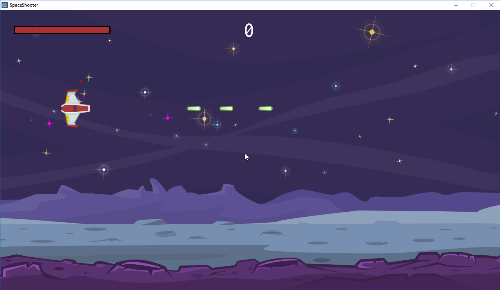

# Godot 3.0 Space Shooter built using C#

This is the source code for a space shooter build using godot 3.0 and c#. It requires a nuget package to run, but you should be able to load this up and build it yourself.

If you want to give it a shot head over to itch.io for a build of the actual game. [Download Here!](https://g4mr.itch.io/godotsharp-shooter "GodotSharp 3.0 Shooter C# Game")

# Notes before opening project & building

- You need to run nuget to restore the nuget packages. Use the following command: `nuget restore SharpShooter.sln`

# Notes for exporting

- You need to include `*.json` for each export templates in order to get the formation json to load. Else you'll see errors in the debug menu and you won't see any enemy ships loading.

&nbsp;

Enjoy, I love Godot 3!